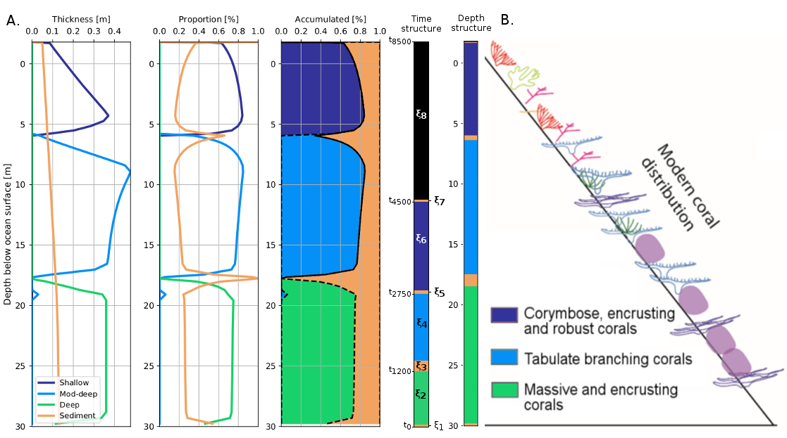

# BayesReef


BayesReef is a framework for implementing Bayesian inference on the deterministic model, _pyReef-Core_. It can simulate data from the _pyReef-Core_ stratigraphic forward model (SFM) to generate samples that are used to approximate the posterior distribution of true values of parameters using a Markov Chain Monte Carlo (MCMC) method. BayesReef is used to quantify uncertainty in  _pyReef-Core_  predictions and estimate parameters in the form of a probability distribution. 

## MCMC methods
MCMC methods, when applied to numerical system models, are used to approximate the posterior distribution of a parameter of interest by randomly sampling in a probabilistic space via a random walk. The random walk generates a chain of samples that are dependent on the current step, but are independent of the previous steps in the chain. The MCMC random walk is designed to take adequately large samples in regions near the solutions of best fit in order to approximate the distribution of parameter values in a model. _BayesReef_ uses the Metropolis-Hastings algorithm MCMC method, which allows for asymmetrical proposals.

MCMC methods are a trademark of a Bayesian inference approach, which is based on Bayes Rule:


This formula encapsulates our _prior_ beliefs about a parameter and the _likelihood_ that a chosen parameter value explains the observed data. Combining the prior and likelihood distributions determine the _posterior distribution_, which tells us the parameter values that maximise the probability of the observed data. 

To visualise the Metropolis-Hastings MCMC technique, an animation of an example is provided below (Huber, 2016).


## Depth-based and time-based inference

_BayesReef_ estimates the posterior distribution of parameters by comparing different forms of data extracted from _pyReef-Core_ simulations. We have two methods of doing this. 

Data about the **depth structure** or the **time structure** of a core can be used as a basis of comparison. The **depth structure** refers to which coralgal assemblage occurs at a given depth interval. The **time structure** of a core refers to which assemblage (or sediment) is deposited at each time interval over the course of the simulation time.




## Installation

### Local install

The code is available from our github [page](https://github.com/pyReef-model/BayesReef.git) and can be obtained either from this page or using **git**
```
git clone https://github.com/pyReef-model/BayesReef.git
```

Once donwloaded, navigate to the **BayesReef** folder and run the following command:
```
pip install -e /workspace/volume/pyReefCore/
```

## Usage

_BayesReef_ is used from a _python script_ directly with Python 2.7.

## References

Stone, James. (2013). Bayes' Rule: A Tutorial Introduction to Bayesian Analysis. 10.13140/2.1.1371.6801. 

Huber, C. (2016). Introduction to Bayesian statistics, part 2: MCMC and the Metropolis–Hastings algorithm. [Blog] The Stata Blog. Available at: https://blog.stata.com/2016/11/15/introduction-to-bayesian-statistics-part-2-mcmc-and-the-metropolis-hastings-algorithm/ [Accessed 19 Jul. 2018].

